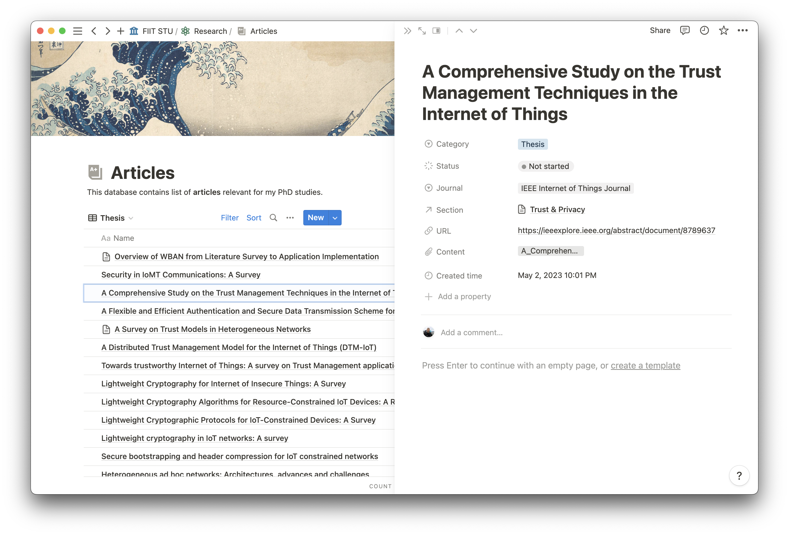

# Notion-OPDS: An OPDS Server Proxy for Notion Databases

**Work in progress**

This repository hosts `notion-opds`, a [OPDS](https://opds.io/) server that acts as a proxy to
the [Notion](https://www.notion.so/) Database. The server incorporates a Redis-based cache layer, aimed at limiting
the number of requests made to the Notion API, in response to its rate limit.

Underpinning `notion-opds` is a Dockerized Flask application. This architecture allows for the ease of deployment
and the benefits of containerization, which enhances consistency across different deployment environments.

The server operates by converting file properties from a Notion Page into OPDS Acquisitions. The
`FLASK_ROOT_PROPERTY` then organizes these acquisitions within an OPDS catalog.

Additional properties are handled as OPDS Facets. This ensures the inclusion of Notion's metadata within the OPDS
environment, providing more extensive data for e-reading applications supporting the OPDS standard.

In conclusion, this repository serves to simplify the integration of Notion content within OPDS-supported
digital reading platforms.

## Environment variables

This table contains only application defined environment variables. For framework related stuff we use default names.

| Name                   | Description                                                   | Example    | Default |
|------------------------|---------------------------------------------------------------|------------|---------|
| FLASK_ROOT_PROPERTY    | Notion property name (of type `select`) for acquisition feeds | `Category` | -       |
| FLASK_NOTION_PAGE_SIZE | Maximum page size of the Notion page query request            | 100        | 100     |

## Limitations

- Relations are not translated as **Facet**

## Medium article

- Cache control in Flask
